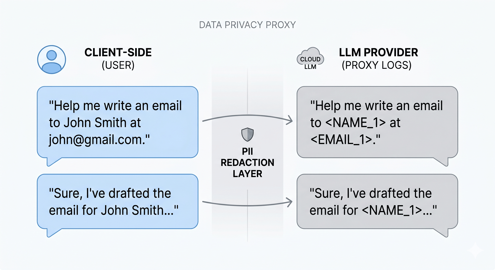

```text
██████╗ ██╗     ██╗███╗   ██╗██████╗ ███████╗ ██████╗ ██╗     ██████╗ 
██╔══██╗██║     ██║████╗  ██║██╔══██╗██╔════╝██╔═══██╗██║     ██╔══██╗
██████╔╝██║     ██║██╔██╗ ██║██║  ██║█████╗  ██║   ██║██║     ██║  ██║
██╔══██╗██║     ██║██║╚██╗██║██║  ██║██╔══╝  ██║   ██║██║     ██║  ██║
██████╔╝███████╗██║██║ ╚████║██████╔╝██║     ╚██████╔╝███████╗██████╔╝
╚═════╝ ╚══════╝╚═╝╚═╝  ╚═══╝╚═════╝ ╚═╝      ╚═════╝ ╚══════╝╚═════╝ 
```

# BLINDFOLD

**The Zero Knowledge Privacy Sidecar for LLM Pipelines.**

`Blindfold` is a high performance, provider agnostic privacy gateway for LLMs. It sits between your app and any LLM API (OpenAI, Anthropic, Ollama, Vertex, and more), scrubs PII using a local privacy filter, and routes your request to the right provider. No code changes, no data leaks.

## How it Works

The LLM stays smart. Your data stays local. 100 percent HIPAA compliant chat in 60 seconds.


<p align="center">
  
</p>


## Why Blindfold is Different

* Universal Routing, supports OpenAI, Anthropic, Ollama, Vertex, and more. Just change the `model` string.
* No Vendor Lock In, powered by [LiteLLM](https://github.com/BerriAI/litellm), so you can swap providers without rewriting code.
* Contextual Privacy, regex is not enough. Blindfold uses a 1.5B parameter bidirectional model to understand context, ensuring that 'Washington' the person is masked, but 'Washington' the city is not.
* Zero Code Changes, point your client to `http://localhost:8080` and go.
* No Data Leaks, PII never leaves your machine. Only masked tokens ever hit the cloud.

## Quickstart

1. Clone this repo.
2. Set your provider API keys as environment variables, for example `OPENAI_API_KEY` or `ANTHROPIC_API_KEY`.
3. Run:

```sh
docker compose up --build
```

4. Point your OpenAI, Anthropic, or Ollama client to `http://localhost:8080`.
5. Use any model name you want, for example `gpt 4`, `anthropic/claude 3 5 sonnet`, or `ollama/llama3`.

Example:

```bash
# To use with Anthropic
export ANTHROPIC_API_KEY=sk ant ...
docker compose up
# Then set your client base url to http://localhost:8080 and model to anthropic/claude 3 5 sonnet
```


## What’s Inside
* FastAPI proxy for `/v1/chat/completions` and more
* LiteLLM for universal provider routing
* Local PII redaction using a privacy filter model
* Redis mapping for PII tokens
* Streams responses, keeps headers, and feels invisible

### Security Architecture
* Bidirectional Context: The local 1.5B MoE model analyzes text in both directions, distinguishing "Apple" the company from "apple" the fruit with high accuracy.
* Deterministic Tokenization: The same PII value always gets the same token within a session, preserving LLM context.
* Ephemeral Vault: Mapping keys are stored in Redis with a TTL, so sensitive data is purged automatically.

## The Performance Budget
Because the model is only 50M active parameters, the latency overhead is less than 100ms. You get privacy without the wait.

## Why This Matters
* Shows Infrastructure Depth, not just an API call. This is a real gateway that handles multi provider orchestration.
* Future Proof, if a new model comes out tomorrow, Blindfold supports it out of the box via LiteLLM.
- **User Choice:** Use Ollama for a 100% local, 100% free, 100% private stack, or Claude/GPT for high-tier reasoning.

---

## Human Support
If you hit a snag, open an issue.

---

## License
MIT. Use it, improve it, share it.
